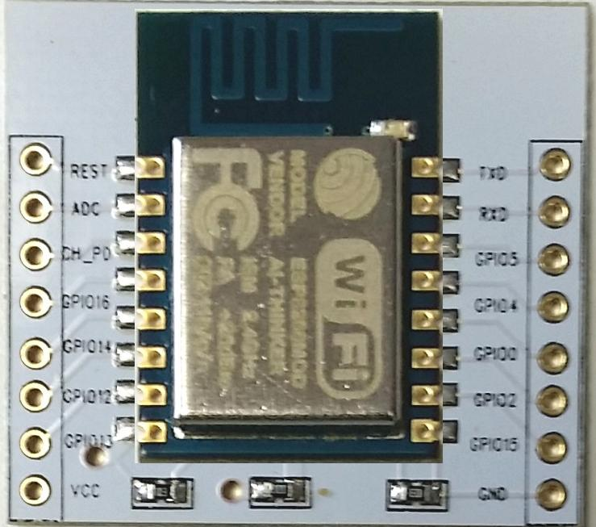
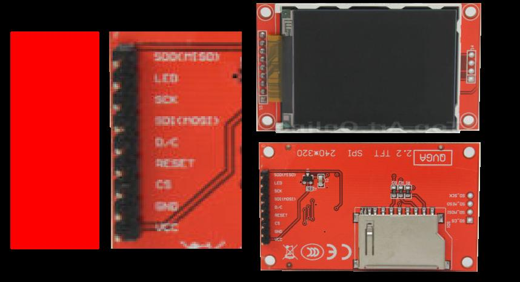

#Arduino JPEGDecoder library( reBrewed for ESP8266)
======================

*Nota. When your done reading this Readme and it's links, feel free to check the [fun section](/fun_section)

##The ESP8266

It's been around for a while now, this micro-controler has pretty much the same computing capability 
then the Arduino Due, but it has its own WIFI connection and IP stacking and a fairly large FLASH 
storing built in, and this is great for project like this one, cause it gives room to store JPEG 
without using any external like SDcard. But there is a cost to that. By looking on the picture below, 
it become obvious that it's impossible to hook a 16 bits data bus TFT module, since the ESP8266 only 
has 11 GPIOs.

The solution is fairly simple, SPI TFT. The ESP8266 is clocked at 80mhz to 160mhz, so it can achieve 
serial data transfer that can compeate with paralele process, offered by the original librarys. When 
set to 160Mhz the ESP8266 can decode a 320x240 JPEG and send it to the screen in less or about 500ms. 
Meaning it can show about 2 pictures per second.

The SerialCsvOut example also benefite from this uC. Well the ESP8266 has a large Serial buffer 
and can send at a pace of 921600bps, that is about 4x greater then the Arduino Due.

Bodmer's original job was excelent, for the MEGA like infrastructure, fully compatible with the 
version 1.6.8 of the Arduino IDE, but need some workaround and fixs to make it fully work with 
the ESP8266 infrastructure. 

A rich set of [examples](./examples) that actually 
works, and technically the whole code is still pretty much the same, will compile the same on Adruino Mega 
and Due, the only diffence is that it also work it ESP8266.

*Note that using the "Paint.exe" picture editor, that come along with windows, to save your JPEG 
will help you in your work.

#News

Considering the fact that ESP8266 has a fairly large amount of Ressource to opperate, and the fact that it 
work very wiell with PicoJPEG. I will probably try to introduce [jpeg-compressor](https://code.google.com/archive/p/jpeg-compressor/) containing
jpgd.cpp and  jpgd.cpp to this project. This will allow the possibilty to encode in JPEG format the picture 
that is on a touch TFT. Also, according to the documentation, *jpgd.cpp decompress a larger set of JPEG format. 
The fact is that they made Pico jpeg to run on small infrastructure like AVR.

**Some section are under construction,  Thank you
for your patience.

##To fix:(contribution welcome)

  + Outer Edge bug when the picture is smaler then the TFT. (Seem 0k now, but It's under investigation)

##To do:

  + Implimante an algorytm that place part of the JPEG in a XY position on the TFT, to be able to view 
  JPEG files that have higher resolution then the TFT's resolution , by a V/H scrolling process.

  + Make an option to Downgrade the color value of each pixel to 8bits color(3R3G2B), to make it compatible with
  the [Stimmer's DueVGA libraries](https://github.com/fredericplante/DueVGA).

  + Get it to pick up the JPEG live from Web socket.
  
  + Rebuild the library structure so SDcard, SPIFFS, and other source of JPEG files container can coexist.
  
##Done:

  - Get it to pick up the JPEG from Serial port to deal with OV528 like, 
  [Serial JPEG, cameras](https://github.com/fredericplante/Grove_Serial_Camera_Kit).

  - At some point, I will have to detach from the Bodmers original libraries to make mine 
  more specific to the ESP8266 infrastructure, Altouth I really hope to work with Bodmer again.

#Below, the original Readmes from Bodmer and Makoto

[EOF]

#Arduino JPEGDecoder library

This Arduino library supports the rendering of Jpeg files stored both on SD card and in arrays within program memory (FLASH) onto a TFT display.

Example images can be found in the "extras" folder.

High Jpeg compression ratios work best on images with smooth colour changes, however the Baboon40.jpg image at only 23.8 KBytes renders quite nicely. Typically a 480x320 image can be compressed without much degradation to less than 32 KBytes, in comparison a 24 bit BMP image would occupy 461 KBytes!  For comaprison the 480 x 320 Mouse480 image has been to compressed to a mere 6.45 Kbytes!

When storing the jpeg in a memory array bear in mind the Arduino has a maximum 32767 byte limit for the maximum size of an array (32 KBytes minus 1 byte).

The decompression of Jpeg images needs more RAM than an UNO provides, thus this library is targetted at the Arduino Mega and Due.

The decompression of Jpegs involves a lot of maths, so it takes a Due about ~1.3s to render a fullscreen (480x320 pixel) image and the Mega will take ~5s to do the same. The time for smaller images will reduce roughly pro-rata with the total pixel count.

This library supports either the SD or SdFat libraries. The SdFat allows a bit-bashed SPI interface to an SD Card which can be convenient for example on pins 50, 51 and 52 of a Due (on Mega these are hardware SPI).

The library has been tested with the 1.6.7 version of the Arduino IDE and may generate error messages at compile time on other versions because "#ifdef \_\_AVR\_\_" is used to distinguish between the Mega and Due and select the correct libraries.

The library has been tested with 3.2" and 3.0" displays based on the HX8357B, HX8357C and ILI9481 driver chips with a 16 bit parallel interface.  Adapting the example sketch for other TFT drivers and their graphics libraries should be quite easy if they support either setWindow() or SetAddrWindow() and pushColor() functions as found in the Adafruit_GFX library.

On a Mega the number of images stored in FLASH must be limited because it they are large enough to push the executable code start over the 64K 16 bit address limit then the Mega will fail to boot even though the sketch compiles and uploads correctly. This is a limitation imposed by the Arduino environment not this library! The Due will work fine with much bigger image sets in FLASH.

This library has been based on the excellent picojpeg code and the Arduino library port by Makoto Kurauchi here:
https://github.com/MakotoKurauchi/JPEGDecoder

Makoto's original Readme below:
==============================

#JPEG Decoder for Arduino

概要
----
Arduino 用 JPEG デコーダです。デコーダ部には [picojpeg](https://code.google.com/p/picojpeg/) を使用しています。

サンプルコード
----
###SerialCsvOut

SD カード上の JPEG ファイルをブロックごとにデコードし、シリアルから CSV を出力します。

変更履歴
----
V0.01 - 最初のリリース
